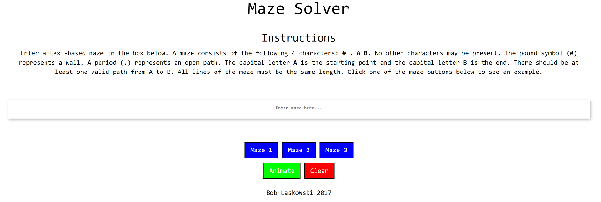
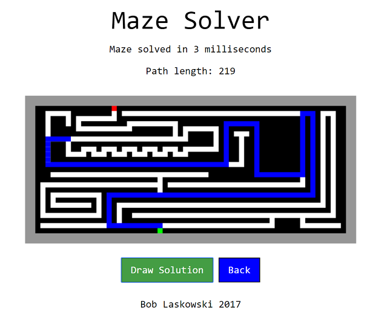

How to Run
---

Clone or download the repo as a .zip file. Extract the zip file. 

Option 1: Run from the commannd line
Navigate into the extracted directory and in to the top level of the project (should contain pom.xml, mvnw, src, 
etc...). Run the command 'mvn spring-boot:run'. Once downloads/compilation are finished and server is running 
navigate to localhost:8080. 

Option 2: Import into IDE
Import into an IDE of your choice (I used IntelliJ) and run as you normally would.

Note: does not work with Java 9 due to Maven/spring-boot issues. Use java 8. Also, Maven must be installed to run from command line. 
Get maven here: https://maven.apache.org/download.cgi. Also, if you are running on windows the JAVA_HOME environment
variable must be set. Read about how to do this here. https://maven.apache.org/install.html. 

** For best experience access localhost:8080 from Chrome. New line characters in mazes loaded from files do not display correctly
in the text area on Safari or Firefox **

If the drawing on the solution page does not display see the known issues at the end. 

Description
---
This project is a retro-themed full-stack solution to solving text-based mazes input by a user on the front end. 
The input is submitted to the back-end through a REST post call. The backend finds the shortest path
through the maze and returns the solution to the front end. The front end then creates a visualization 
of the maze. 

The landing page provides instructions to the user and allows loading of 3 sample mazes of increasing
difficulty. When the user clicks the 'Animate' button, a REST post call is sent to the backend server
with data passed through JSON. The JSON is mapped to a Java object, the input is validated, the A* search
algorithm is used to finding the shortest path from A to B. Either a solution or an error message is returned
to the frontend. The frontend then uses JavaScript to manipulate the DOM and display the solution drawn
using HTML5 Canvas. The drawing is slowed down for an animated effect. The user can then click 'Draw Solution'
to see the shortest solution path drawn on the canvas over the map. 

More info on A* Search algorithm: http://www.geeksforgeeks.org/a-search-algorithm/

A valid maze may contain the following types of characters:
* `.` represents an open road
* `#` represents a blocked road
* `A` represents the starting point
* `B` represents the destination point

Anything outside the bounds of the array is considered a wall. In addition, 
you may only move in horizontal or vertical directions. Diagonal movements are 
not allowed. Only these characters are allowed. Errors will be thrown for invalid
characters. All lines must be of equal length. There must only be one starting point (A)
and one destination point (B). There also must be at least one valid path from A to B. 

Example input maze:
```
##########
#A...#...#
#.#.##.#.#
#.#.##.#.#
#.#....#B#
#.#.##.#.#
#....#...#
##########
```

Example simplified visual of the solution, using `@` to represent the correct path.
The shortest number of steps in this case is 14. 
```
##########
#A@@.#...#
#.#@##.#.#
#.#@##.#.#
#.#@@@@#B#
#.#.##@#@#
#....#@@@#
##########
```

Running Images
---




Technologies used
---
You don't have to use these, but these are what we use and recommend.
* Java (Spring Boot)
* Angular 
* Bootstrap/CSS
* HTML5 Canvas
* REST, JSON

Known issues
---
* If Draw Solution button is clicked before maze finishes drawing, some of the solution may be overwritten by
white. Click draw solution again to see complete solution.
* A timeout function used to navigate to the solution display page so that the rest call can be made and canvas
element can be loaded. If rest call and navigation takes longer than timeout, you will get a "TypeError: Cannot set 
property 'width' of null" due to the canvas element not being initialized yet. Timeout is currently set to 2000 ms 
(2 seconds). If rest call and navigation takes longer this can be remedied by increasing the timeout. This is also 
the reason for the delay in the loading of the drawing on the solution page. This could be fixed by implementing 
angular's routing. 
* Display is not optimized for low resolution screens. You will likely see a lot of horizontal scrolling with screen 
solutions below 1080p. Looks great in 4K :D
